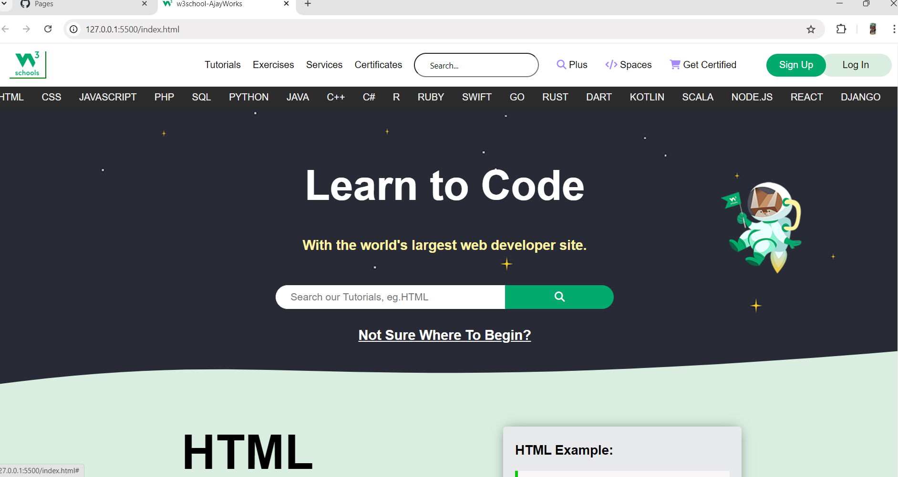

# W3Schools Clone Project

Welcome to the W3Schools Clone Project! This is a basic HTML and CSS replica of the W3Schools website. The project demonstrates my skills in front-end development by recreating the look and feel of the popular W3Schools site.

## 📸 Preview



## 🔗 Live Demo

You can view the live version of the project here: [Live Demo](https://ajaykumar-dev-07.github.io/w3schoolsclone/)

## 🔧 Technologies Used

- **HTML5**
- **CSS3**

## 🚀 Features

- **Responsive Design:** Layout adjusts to different screen sizes.
- **Static Content:** Replicates the structure and styling of W3Schools pages.

## 🛠️ Installation & Setup

1. **Clone the Repository:**

   ```bash
   git clone https://github.com/ajaykumar-dev-07/w3schoolsclone.git
